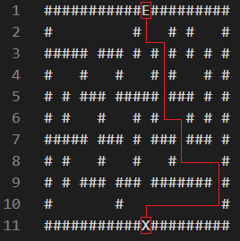

## Maze Solver

**_Maze Solver_** is a java program that solves mazes. It takes a maze from a text file, transforms it into an ArrayList and runs a Queue based algorithm to solve the Maze.

## Explanation

**#** (Delimiter)
<span style="color:red">**E**</span> (Entrance)
**X** (Exit)


<span style="font-size: 15px">_This text file can be found in `src/mazes/maze1.txt`_</span>

If you wish to generate a random maze, here is a [website](https://thenerdshow.com/amaze.html) that does it for you. _Do not forget to add the **E** and **X** to let the program know of the entrance and the exit._

## Usage

Navigate to the `src/main` folder and compile the java files with the following command :

```bash
javac *.java
```

Navigate back to the `src` folder and run the `Solver.java` with the following command :

```bash
java main.Solver maze1
```
